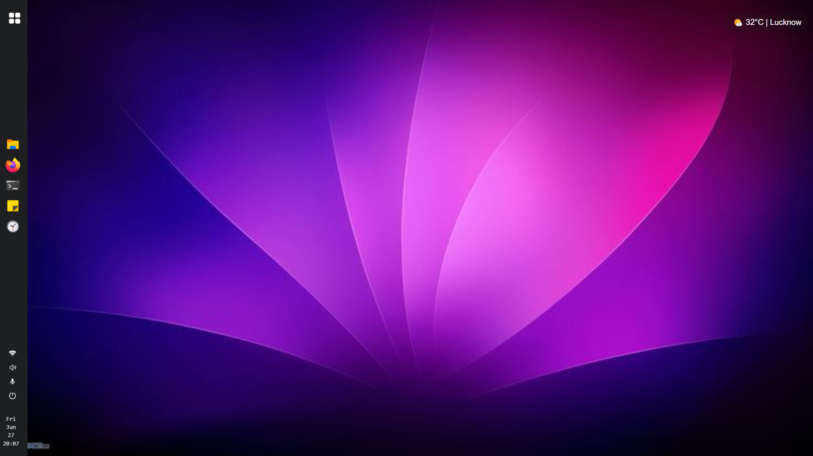

# Virtual Linux OS in the Browser

A Linux-inspired virtual operating system built **entirely with HTML, CSS, and JavaScript** — no frameworks, no libraries, just pure front-end power.

---

## 🚀 Features

* 🔐 **Lock Screen & Login Interface**
  GNOME-style lock screen with smooth transitions to desktop.

* 🖥️ **Virtual Desktop Environment**
  Dynamic desktop with draggable folders and responsive layout.

* 📁 **File Explorer**
  Fully functional file explorer with sidebar navigation, folder creation, rename/delete options, and drag-drop support.

* 🧠 **Sticky Notes App**
  Create, delete, and persist notes — just like real sticky apps.

* 🕒 **Clock & Timer App**
  Live clock, stopwatch, and Pomodoro-like utilities in a resizable window.

* 🔌 **App Grid Menu**
  Launch apps like **Netflix**, **Telegram**, **GitHub**, and **Firefox** from a Linux-style app drawer.

* 🌐 **External App Integration**
  Load real external sites within the virtual OS with **custom back button** to return smoothly.

* 💻 **Terminal Emulator**
  Minimal Linux-style terminal that accepts basic commands like `lock`, `shutdown`, etc.

* 🔋 **Power Popup Menu**
  Realistic power menu for Shutdown, Reboot, Logout, and Restart (with animated feedback).

---

## 📸 Screenshot Preview

---

## 💡 Technologies Used

* **HTML5** — semantic structure
* **CSS3** — Linux-themed dark UI with blur effects and transitions
* **JavaScript (Vanilla)** — DOM manipulation, dynamic events, and local storage

---

## 🧠 Idea Behind

This project simulates a Linux desktop experience within the browser — perfect for learning DOM, UI/UX principles, and front-end logic without relying on libraries.

---

> *"Linux in your browser. Built with love, styled with precision."*
